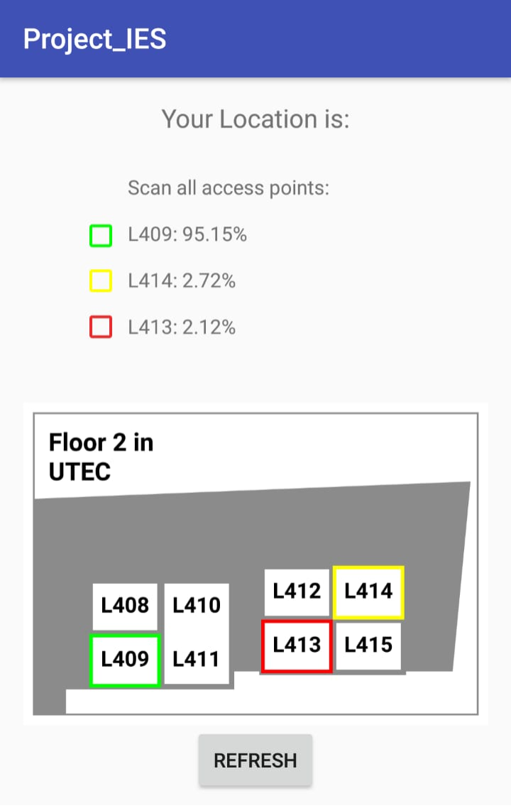
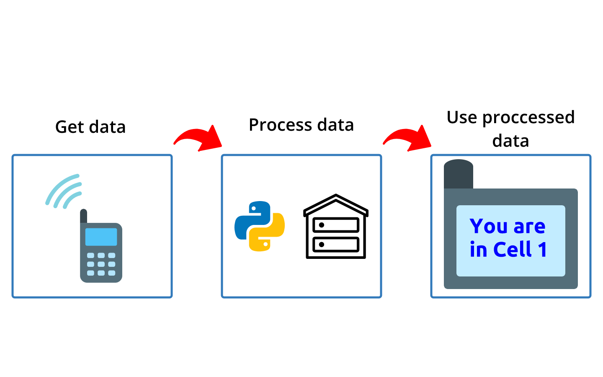

# Indoor-Localization-Using-Bayesian-Filters
An approach to indoor localization using an Android cellphone and Bayesian Filters

## Block Diagram

## Instructions

1. Get csv file
2. Change the path file in line 30 to the new path
3. Run **main.py** file
4. Get xml file from **OutputFiles** Folder
5. Move the previous files to Android Studio project
6. Program Android cellphone

## References
1. Bayesian Filters
2. Android Development

